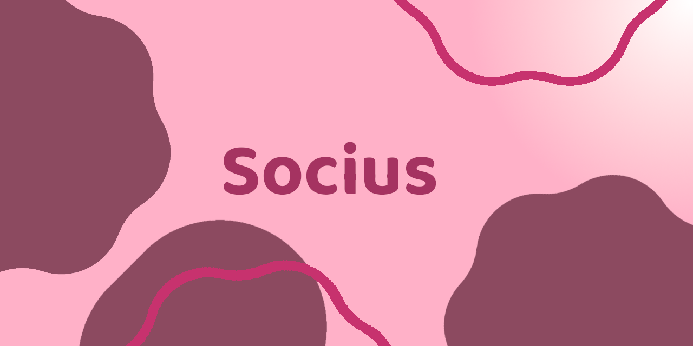 

# Socius
I wanted a modern looking, open-source M3 contacts app. I didn't find a good one, so I am making my own. 
This is an open-source Android contact app, local at the moment. In the future it should connect to a self-hosted server like Nextcloud or even a dedicated Socius Server to sync the contacts.

# Download
[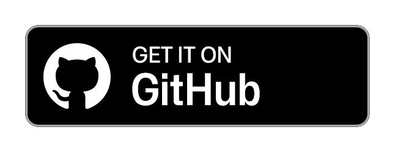](https://github.com/Benkralex/Socius/releases)
[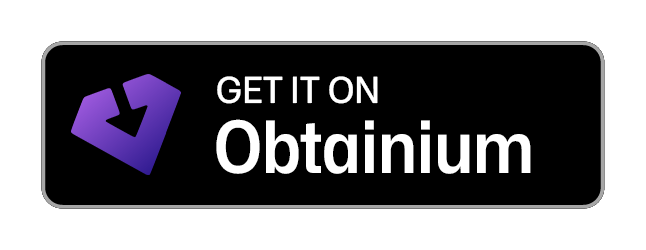](https://apps.obtainium.imranr.dev/redirect?r=obtainium://add/https://github.com/Benkralex/Socius)

# Screenshots
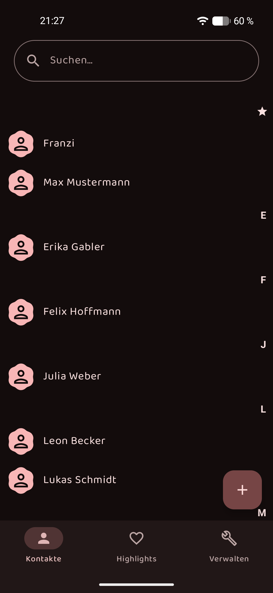
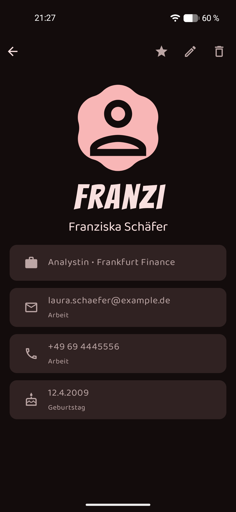
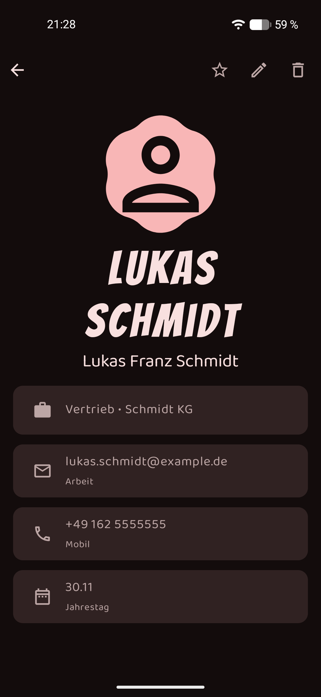
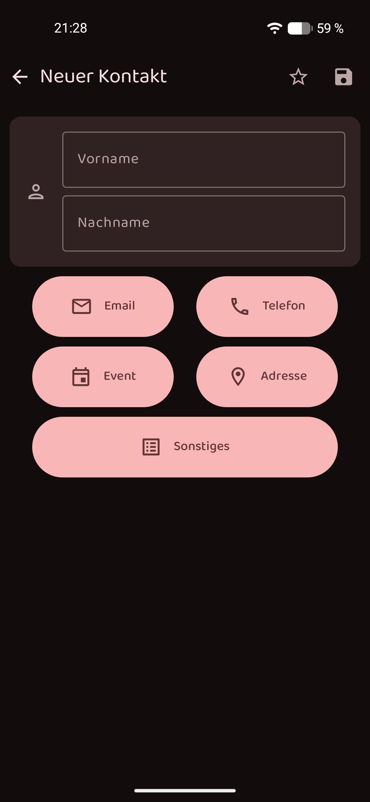
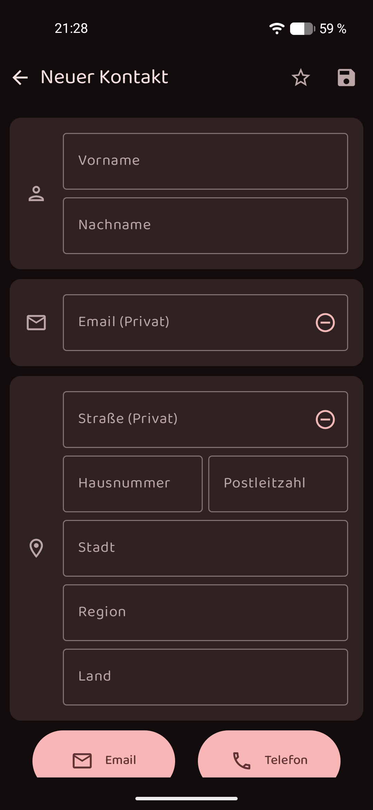
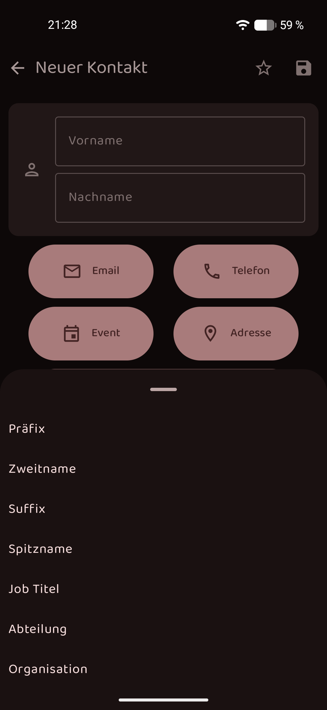
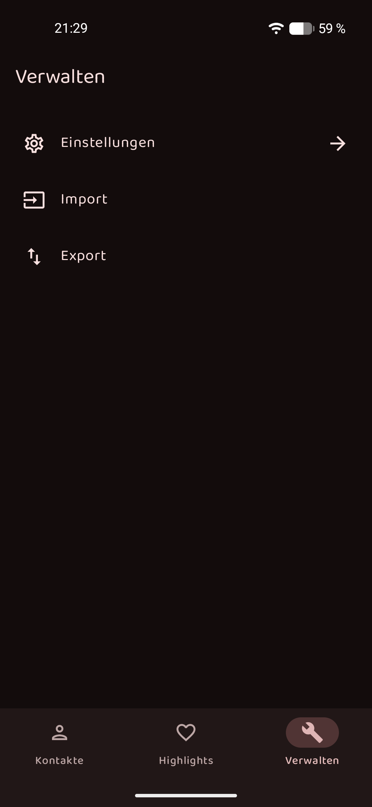
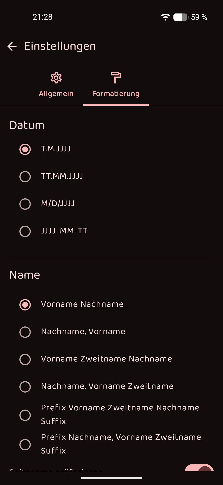

# Features (finished)
- Read Android-system-contacts and display them as read only
- Display Contacts in detail-view
- M3 Design
- Create local contacts
- Sync local contacts with Android-System (SyncAdapter)
- Import and export contacts as Google CSV and Socius JSON
- Show active events (like birthdays, anniversarys) in the highlights page

# Features (in progress)
- Edit contacts

# Features (not started)
- Sync with CalDAV-Server
- Sync with Nextcloud
- Import and export as VCard
